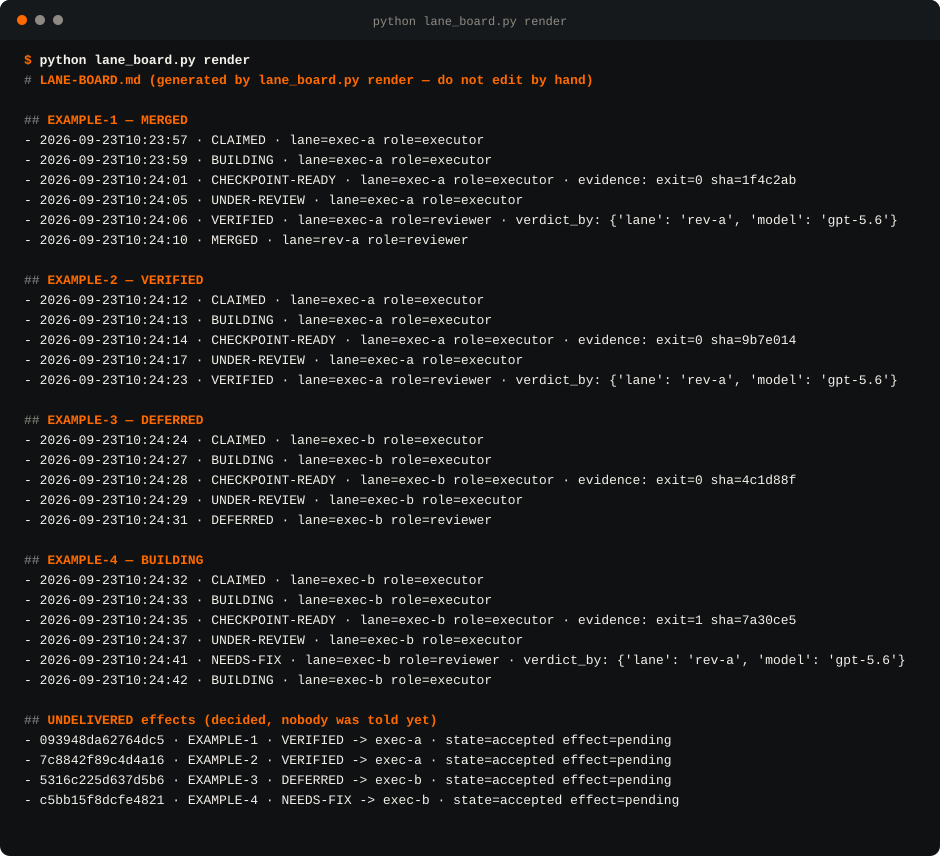
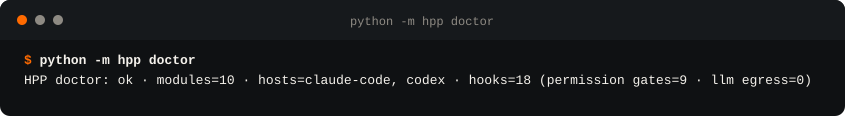
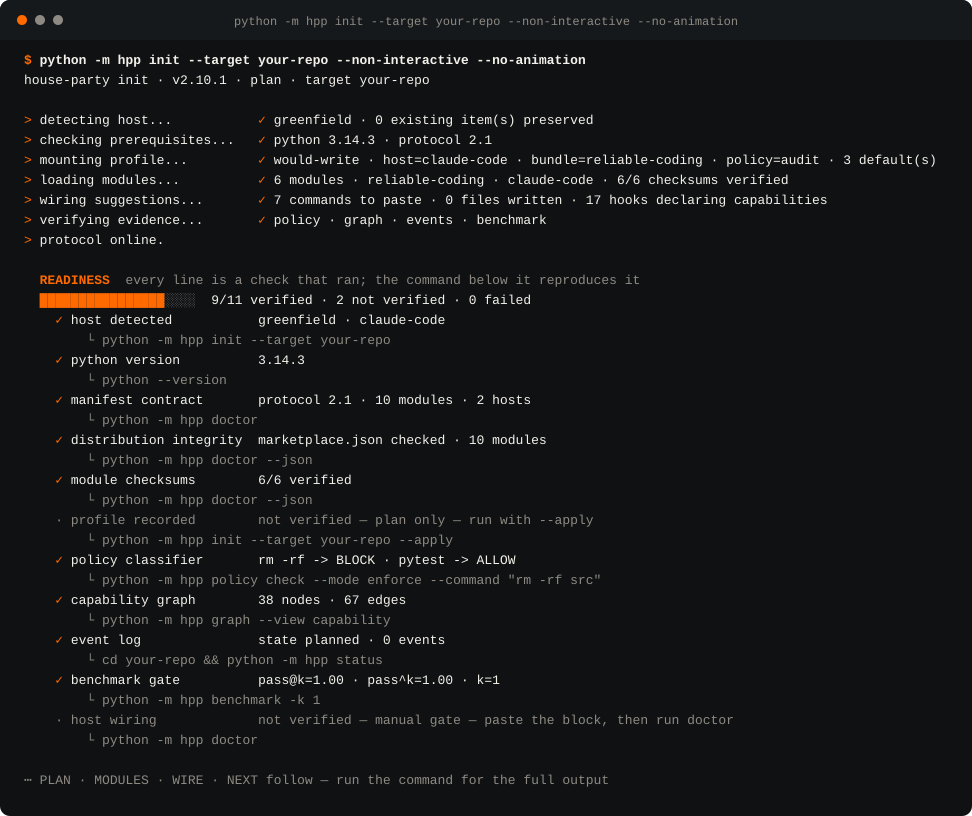

<p align="center">
  
</p>

<p align="center"><sub><code>AGENTS &nbsp;·&nbsp; EVIDENCE &nbsp;·&nbsp; MEMORY &nbsp;·&nbsp; PROTOCOL &nbsp;·&nbsp; CONTINUITY</code></sub></p>
<p align="center"><sub>spec-driven &nbsp;·&nbsp; wave-driven &nbsp;·&nbsp; lane-isolated</sub></p>

<p align="center">
  <a href="https://github.com/rusharlabs/house-party-protocol/actions/workflows/ci.yml"></a>
  <a href="https://github.com/rusharlabs/house-party-protocol/releases/latest"></a>
  <a href="https://scorecard.dev/viewer/?uri=github.com/rusharlabs/house-party-protocol"></a>
  <a href="https://www.bestpractices.dev/projects/14830"></a>
  <a href="LICENSE"></a>
  <a href="#quickstart"></a>
  
</p>

<p align="center"><sub>English &nbsp;·&nbsp; <a href="README.pt-BR.md">Português (Brasil)</a></sub></p>
<p align="center"><sub><a href="https://rusharlabs.github.io/house-party-protocol/">Project site</a> &nbsp;·&nbsp; the catalogue, the manual and the design system, rendered &nbsp;·&nbsp; <a href="SUPPORT.md">Support</a> &nbsp;·&nbsp; <a href="https://github.com/rusharlabs/house-party-protocol/discussions">Discussions</a></sub></p>

# House Party Protocol

**Agent teams under evidence: only what they prove counts as done.**
Evidence, not trust, for Claude Code and Codex CLI. Waves and lanes split the work, a verdict from
the builder's own lane or model family is refused, and nothing is verified without recorded evidence.

House Party Protocol (HPP) is a local-first harness for coding agents. It sits around the work
an agent does in Claude Code or Codex CLI and turns four questions into executable contracts:
what may run, who may approve, what counts as proof, and where the next step comes from after an
interruption. The order of work is not negotiated in the conversation: a spec compiles into a
WorkGraph, the graph runs in topological waves, parallel sessions work in isolated lanes, and every
wave closes on evidence, never on a sentence.

The harness is a Python package with no runtime dependencies (`python -m hpp`), a manifest that
declares the protocol, a set of installable modules, and one distribution channel per host.
Nothing runs in the background. Every verdict it produces can be re-derived from files on disk.

<p align="center">
  
</p>

**Install in one line** — the same wheel the release workflow builds and attests:

```bash
pip install house-party-protocol
hpp doctor && hpp init --target ../your-repo
```

In Claude Code: `/plugin marketplace add rusharlabs/house-party-protocol`. In Codex CLI:
`codex plugin marketplace add rusharlabs/house-party-protocol`. Every step, and the checksums to
verify first, are in the [Quickstart](#quickstart).

- **No model calls, no runtime dependency.** The package is standard library only, and a test fails
  the build if that changes (`tests/test_stdlib_only.py`).
- **Every terminal capture on this page is rendered from real output.** The command that produced it
  is recorded inside the image file; nothing is drawn by hand.
- **Releases you can verify.** `SHA256SUMS` on every release, build provenance you check with
  `gh attestation verify`, and the OpenSSF Best Practices badge above.
- **Limits written down.** What the harness does not do is a section of this page:
  [Honest limits](#honest-limits).

## Agent teams, under evidence

An agent team here means two or more coding-agent sessions or subagents working on one repository:
in parallel, reviewing each other, sometimes competing for the same task. Every one of them reports
"done". Something orchestrates them: a lead agent handing out subagents, a script that fans the work
out, a CI job, or you with four terminals. HPP is not that orchestrator and sits under any of them:
the orchestrator decides who works on what; HPP decides what counts as done. It schedules nothing,
pays for nothing and calls no model; the lane-kit starts a session only on an action you take: a Lane
Dashboard action you confirm, or the seats of a `/deliberate` you invoke. Each contract below has a
command that shows it holding, and its refusals exit non-zero, so a script can use them as gates.

| what the team does | what HPP holds it to | the command that shows it |
|---|---|---|
| **split the work** | | |
| plans work for several agents | a spec compiles into a WorkGraph; units with no edge between them share a wave, and a cycle is an error with its path named | `hpp work plan` · `hpp work waves` |
| runs sessions side by side | each session claims a lane: paths, exclusivity, heartbeat; only two live exclusive lanes on the same paths collide, and a dead lane never does | `hpp map lane --now` |
| passes messages between agents | a message is a file routed by one `## To: <lane>` line; the heartbeat announces it mid-session, and a verdict delivers itself to the lane it concerns | lane-kit `evals/mailbox-e2e.sh` |
| staffs development roles | twelve roles as commands and subagents, each with its tool set declared | `hpp graph --view capability --format json` (`agent-roles`) · `ls frameworks/dev-squad-kit-1.2.0/agents` (12) |
| **review independently** | | |
| reviews another agent's work | a verdict from the builder's own lane or model family is refused; the review lenses ship without `Write` or `Edit`; a routing panel judged by the maker's own model family is refused | `lane_board.py --self-test` · `hpp attest create --maker a --checker a` → exit 2 · `hpp route --deliberation <session> --maker-family <family>` |
| runs specialist reviewers | four read-only lenses answer in one shape (`hpp.findings/v1`); the core derives the verdict and refuses a key the contract does not define | `hpp findings check` |
| asks several models to deliberate | seats from at least two model families, a judge in a lane no participant uses, a blind first round, a stop by rule, and the dissent that lost kept in a sealed record | `hpp deliberate plan` · `hpp deliberate record` · `hpp deliberate verify` |
| lets agents compete for one task | a reviewer from another lane and another family picks the winner; the others become `NOT-SELECTED`, and the winner still needs its own `VERIFIED` | `lane_board.py compete` · `lane_board.py select` |
| **accept only what is proven** | | |
| says "done" | the criterion command runs with its exit code measured outside the model and its declared artifacts hashed; `verified` needs recorded evidence | `hpp evidence run` · `hpp evidence verify` · `hpp status` |
| loops until done | the loop advances only through recorded events; a completion tag in the transcript does not end it, and its iteration ceiling is its budget | `hpp event append` · `hpp status` · operator-kit loop gate (tests T1–T4) |
| hands over an approval | bound to the spec hash, the base commit and a snapshot of every file; one changed byte blocks it | `hpp attest verify` |
| passes once | `pass@k` and `pass^k` reported apart over k runs | `hpp eval run -k 3 --gate both` |
| shares context | whole blocks under a character budget, a hash per block, the omitted ones listed, secret-like text refused | `hpp context compile --budget` |
| picks up after a crash | the next step is derived from the hash-chained event log, not from a summary | `hpp resume` · `hpp event verify` |
| takes advice from a model | recorded as advisory and raise-only; a decider is measured on labelled cases before anyone trusts it | `hpp decide validate` · `hpp decide eval` |

On Claude Code these modules run natively once you paste the wiring; on Codex CLI the same
capabilities are explicit commands. `hpp graph --view capability --format json` names which, per
module. The pip wheel carries the harness (`hpp`); the lane board, the mailbox, the roles and the
lenses arrive with the modules (see [Quickstart](#quickstart)).

## The problem

An agent says "done". The sentence is fluent, the diff looks plausible, and nothing checked it.
The tests it reports may have run against a stale checkout, or may not have run at all; text in
a transcript is not an exit code. The approval a reviewer gave yesterday still reads "approved"
this morning, after the spec changed and three files moved. Nobody re-opened it, because nothing
tied the approval to the bytes it approved.

Two sessions share one repository. One rewrites a module while the other reviews it; the review
lands on a version that no longer exists. Or the agent that wrote the code is the one that
reviews it, with the same blind spots and a pen in hand: it "fixes and proceeds", and the defect
in the process never surfaces. A lock left by a session that died at 3 a.m. blocks every other
session at 9, because a stale lock and a live one look identical.

Then the failures that lie by being technically correct. A service answers 200 while its data is
from Tuesday. A signal stamped in the future is reported as fresh. A counter returns zero because
the pattern never matched, and zero is read as "no problems". A loop takes "one more iteration"
past its budget. A summary restored after a crash is treated as a to-do list, so a finished step
runs again and overwrites its own result. None of these raise an error. That is what makes them
expensive.

## How the harness responds

Each failure above has a mechanism in the code, and each mechanism has a command that shows it.

| failure | mechanism | command |
|---|---|---|
| "done" without proof | append-only event log; `verified` needs recorded evidence; an out-of-order event is refused before anything is written | `hpp event append` · `hpp status` |
| stale approval | attestation bound to spec hash, base commit and a full snapshot of tracked and untracked files; any divergence blocks reuse | `hpp attest create` · `hpp attest verify` |
| author reviewing own work | maker and checker must differ (case-insensitive) or the attestation is refused; module checkers ship with no `Write` and no `Edit` | `hpp attest create --maker a --checker a` → exit 2 |
| stale lock, territory collision | Lane Map derives `alive` / `suspect` / `dead` from heartbeats; a dead lane never produces a collision | `hpp map lane --now` |
| service up, data old | Monitor Map separates `healthy`, `stale`, `skew` and `unknown`, with declared freshness and clock tolerance | `hpp map monitor --now` |
| dangerous command | policy classifier returns `ALLOW`, `MANUAL` or `BLOCK`; `enforce` maps them to exit 0, 1, 2 | `hpp policy check --mode enforce` |
| parallelism by guesswork | WorkGraph turns declared dependencies into topological waves; a cycle is an error, not an empty wave | `hpp work waves` |
| a criterion cited by a test that never ran | every acceptance criterion is linked to the tests whose docstring cites it; with a JUnit XML report of the run, a criterion whose citing tests were skipped, never collected or not tests at all is `cited_not_run`, and one with a failing citing test is `failed` — citation alone is never counted as execution | `hpp work coverage --junit` (new in 2.8.0) |
| a review that finds whatever it happened to look for | four review lenses without file-editing tools (read-only proved when seated by `house_session.py`), each looking for one kind of defect (verification gap, partial set, deletion, stale evidence); every lens answers in `hpp.findings/v1` — stable code, severity, file and line, evidence, and the universe it inspected — and the core derives the verdict and refuses a document with a key the contract does not define | `hpp findings check` (new in 2.8.0) |
| context silently truncated | compiler fits whole blocks under a character budget, records a hash per block, and refuses secret-like material | `hpp context compile` |
| one lucky run | `pass@k` and `pass^k` measured separately over `k` executions | `hpp eval run` · `hpp benchmark` |
| an advisor nobody measured | a decision made outside the harness is recorded as advisory and raise-only, with abstention and instrument failure as outcomes; a declared decider is measured on labelled cases before it is trusted — hpp itself calls no model | `hpp decide validate` · `hpp decide eval` (new in 2.6.0) |
| a green screenshot nobody can re-derive | the criterion command you declare (an end-to-end spec, a test suite) runs with its exit code measured outside the model and every declared artifact hashed; it passes only on exit 0 with every declared pattern matched by a file this run wrote, and `verify` blocks an edited record or a changed artifact — the self-hash is not a signature, so a checker re-runs the command or asks for one (`run --sign-key` signs the record with an SSH key, `verify --allowed-signers` demands it); hpp drives no browser | `hpp evidence run` · `hpp evidence verify` (new in 2.6.0) |
| a retriever nobody measured | a retriever you declare as a command is scored on labelled queries — hit@k, recall@k, precision@k, MRR, nDCG@k — and a timeout, a crash or a malformed answer is an instrument failure counted apart, never a zero; the answer generated from what it found is not judged | `hpp retrieval eval` (new in 2.6.0) |
| citations nobody resolved | every `[ID:x]` marker must name an id of the context the answer was written from: an unknown id, a range or an empty marker blocks, a number with no marker warns — a marker that resolves proves the source exists, not that it supports the sentence | `hpp cite check` (new in 2.6.0) |
| a winner picked by whoever built it | N lanes each build their own attempt at one task; a reviewer of another lane and another model family selects the winner, the losers become a terminal `NOT-SELECTED`, and no candidate reaches `MERGED` before the choice — picking 1 of N is `pass@N`, so the winner still needs its own `VERIFIED` and `pass^k` | `lane_board.py compete` · `lane_board.py select` (lane-kit 1.4.0, new in 2.6.0) |
| a green check nobody tried to break | the criterion runs on a copy of the workspace, clean (it must pass) and once per mutant (it must fail); a mutant it lets through is a named blind spot, and a criterion that fails on the clean copy has no control and gets no score | `hpp evidence mutate` (new in 2.7.0) |
| a panel of agents agreeing with itself | a House Session names every seat's pinned model and family; it needs two families, a judge outside the participants' lanes and a dissenting seat where the question calls for one; the first round is blind and that is checkable, a seat that did not answer is not judged and blocks the verdict, the session stops by rule, and the record seals itself and keeps the dissent that lost; with declared evidence a `fact` grounds only through a reference that resolves, and a verdict over grounded dissent needs the judge's steelman of it (2.8.0) — the panel is measured as one decider by the same ruler; hpp calls no model | `hpp deliberate record` · `hpp deliberate verify` (new in 2.7.0) |
| installer that writes before you read | `hpp init` prints a plan; `--apply` writes one file; host wiring stays a paste | `hpp init` |

The attestation rows above, run for real in a throwaway repository: an author refused as its own
checker, an approval that verifies, one byte appended to a committed file, and the same approval
blocked with exit 2.

<p align="center">
  
</p>

## Cross-model by construction

The harness never assumes one brain. Two independent mechanisms, neither of which names a model:

| claim | mechanism | command |
|---|---|---|
| the reviewer is not the author | maker and checker must differ or the attestation is refused; module checkers ship with no `Write` and no `Edit` | `hpp attest create --maker a --checker a` → exit 2 |
| the verdict records WHICH reviewer | the wave-review record carries the reviewing lane and the reviewing model, so a verdict can be traced to the brain that gave it | `--verdict-by-lane` · `--verdict-by-model` |
| a missing reviewer is a state, not a silence | when no independent checker is reachable, the loop records the deferral instead of passing | `--checker-unavailable` |
| the work is routed by TIER, not by vendor | a declared request resolves to one of the provider ids YOU declared, with a risk floor and fallback only upward | `hpp route --policy economy\|balanced\|frontier` |

Two honesties about that last row. The route it returns DOES name a provider — `{'provider': ..., 'tier': ...}` — but only one that you listed in the request: the harness never chooses a vendor you did not declare, never ranks them, and never reads a price. And the shell a checker needs to inspect is a promise, not a capability: `Write` and `Edit` are absent by configuration, while `Bash` is constrained by instruction, so where that matters the working tree is captured before and after the review and compared — a checker that touched it invalidates its own findings (`rules/loop-maker-checker.md`).

Hosts today are **Claude Code** and **Codex CLI**: same protocol, same exit codes, same maps. A
lane driven by one and reviewed from the other is the ordinary case, not an integration project.

Those three rows are a state machine, not a convention. `lane-kit` keeps one append-only board per
repository and is its only writer: `CHECKPOINT-READY` only from the lane of the item's last build
event (`CLAIMED`, `BUILDING` or `CHECKPOINT-READY`) and only with evidence pasted in, a verdict only
from another lane **and** another model family,
`DEFERRED` the only verdict an unreachable checker can produce, and `MERGED` only on top of a
`VERIFIED` that is already on the board.

<p align="center">
  
</p>
<p align="center"><sub>The board those rows produce, as <code>multi-session/lane-kit-1.7.1/scripts/lane_board.py</code> prints it: four example items driven through the machine, every event naming the lane that wrote it, the evidence pasted at checkpoint, and — for a verdict — the lane and the model that gave it. Two attempts were refused on the way there, both <code>exit 1</code>: a verdict from the builder's own lane (<em>maker≠checker violated: reviewer (exec-b) is the SAME lane as the builder</em>) and merging a 🔴 item without <code>--human-approved</code>. The last block is the one nobody thinks to ask for — verdicts already decided whose lane has not been told. Text rendered from the command's real stdout by <code>scripts/render_terminal_svg.py</code>, like the two captures above.</sub></p>

## Quickstart

> [!WARNING]
> **Official sources only.** This project is published at
> `github.com/rusharlabs/house-party-protocol` and through the Claude Code plugin channel
> `rusharlabs/house-party-protocol` — nowhere else. A copy under another account, or on a package
> index this README does not name, is not this project. Every release ships `SHA256SUMS` and
> every module ships `CHECKSUMS.txt`; see [SECURITY.md](SECURITY.md).

Requirements: Python 3.10 or newer (`pyproject.toml`), `git` on `PATH` for attestation, no
third-party packages. CI exercises Python 3.10 to 3.13 on Linux, macOS and Windows
(`.github/workflows/ci.yml`); older interpreters are not promised because nothing measures them.

```bash
pip install git+https://github.com/rusharlabs/house-party-protocol@v2.10.1
hpp doctor
hpp init --target ../your-repo
```

From 2.6.5 on, every release is also published to PyPI by the release workflow, with no
stored token: `pip install house-party-protocol==<version>` installs the same wheel.

> **Installing with an agent?** Paste this URL at it and say to follow it:
> `https://raw.githubusercontent.com/rusharlabs/house-party-protocol/main/INSTALL_FOR_AGENTS.md`
>
> [INSTALL_FOR_AGENTS.md](INSTALL_FOR_AGENTS.md) is written for the agent, not for you: it
> detects the host, checks the preconditions instead of assuming them, and requires the agent to
> read `hpp init`'s plan to you before a single file is written.

<p align="center">
  
</p>
<p align="center">
  
</p>
<p align="center"><sub>The two commands as they print from a clone of this repository. Both images are text rendered from the real output by <code>scripts/render_terminal_svg.py</code>; regenerate them after any change to the wizard.</sub></p>

The package has no runtime dependencies and ships its own manifest and benchmark suite, so `hpp`
— including `hpp benchmark` and `hpp --self-test` — answers from any directory once installed
(`pipx install git+…` works the same way). From a checkout, the CLI is the module:

```bash
git clone https://github.com/rusharlabs/house-party-protocol.git
cd house-party-protocol
python -m hpp doctor
```

`hpp init` runs six fixed stages and prints a plan. Each boot line completes only when its stage
has finished; readiness counts checks that ran, and each item carries the command that
reproduces it. What it can verify depends on where `hpp` runs. This repository is the emitted
distribution — harness, manifest, the ten module directories with their `CHECKSUMS.txt`,
`marketplace.json` and the module installer — and from a clone of it, against an empty target
(`python -m hpp init --target <empty-dir> --non-interactive --no-animation`), the output is:

```text
> detecting host...           ✓ greenfield · 0 existing item(s) preserved
> checking prerequisites...   ✓ python 3.14.3 · protocol 2.1
> mounting profile...         ✓ would-write · host=claude-code · bundle=reliable-coding · policy=audit · 3 default(s)
> loading modules...          ✓ 6 modules · reliable-coding · claude-code · 6/6 checksums verified
> wiring suggestions...       ✓ 7 commands to paste · 0 files written · 17 hooks declaring capabilities
> verifying evidence...       ✓ policy · graph · events · benchmark
> protocol online.

  READINESS  every line is a check that ran; the command below it reproduces it
  ████████████████░░░░  9/11 verified · 2 not verified · 0 failed
```

The two items not verified are the two that only a later action can prove: the profile (plan
only; `--apply` writes it) and the host wiring (a paste you do yourself). The pip install is a
different channel: the wheel carries the harness, the manifest and the benchmark suite, but no
module directories and no `marketplace.json`. The same command from that install, on the same
empty target, reads:

```text
> detecting host...           ✓ greenfield · 0 existing item(s) preserved
> checking prerequisites...   ✓ python 3.14.3 · protocol 2.1
> mounting profile...         ✓ would-write · host=claude-code · bundle=reliable-coding · policy=audit · 3 default(s)
> loading modules...          ✓ 6 modules · reliable-coding · claude-code
> wiring suggestions...       ✓ 7 commands to paste · 0 files written · 17 hooks declaring capabilities
> verifying evidence...       ✓ policy · graph · events · benchmark
> protocol online.

  READINESS  every line is a check that ran; the command below it reproduces it
  █████████████░░░░░░░  7/11 verified · 4 not verified · 0 failed
```

The two extra items there — distribution integrity and module checksums — are reported as not
verified because there is nothing to measure them against, never as passed. In either channel
nothing is written until you re-run with `--apply`, and then exactly one file is written:
`.hpp/profile.json`. `hpp init --json` gives the same report as JSON for CI and agents;
`--non-interactive`, `--yes` and `--profile` answer the questions without a prompt. The fourth
question is optional and new in 2.6.0: `--decision-advisor off|typesafe|openrouter|compatible` records a typed-decision
advisor you will integrate yourself (default `off`) and prints how. The advisor the wizard knows by
name is Jev, a hosted typed-decision model served by TypeSafe AI (`typesafe`) and through OpenRouter
(`openrouter`); `compatible` takes any server that speaks the same format. hpp never calls it: the
adapter lives in [examples/typed-decisions](examples/typed-decisions/README.md), runs only when you
run it, and `hpp decide eval` measures it against a baseline before anyone trusts it — the
[manual](https://rusharlabs.github.io/house-party-protocol/MANUAL.html#decide) walks through it.

After `--apply`, paste the wire block the command printed. For Claude Code that is the native
plugin channel:

```text
/plugin marketplace add rusharlabs/house-party-protocol
/plugin install operator-kit@house-party-protocol
```

For Codex CLI the same repository is a plugin marketplace of its own, for the modules that carry
skills (skills only; hooks stay off):

```text
codex plugin marketplace add rusharlabs/house-party-protocol
codex plugin add operator-kit@house-party-protocol
```

The module installer copies any supported module into `.agents/hpp/<module>` and runs its declared
smokes; that copy is what installs runtime, scripts and templates. On Claude Code, a module without
a plugin hook is copied by hand (each module's README shows the `cp -r` line) and the installer
detects, wires and verifies it. Either way it plans first and applies only on a second, explicit
invocation:

```bash
python installers/kit-forge-1.5.1/kit_doctor.py install \
  --kit frameworks/operator-kit-1.8.0 --host codex --target ../your-repo
python installers/kit-forge-1.5.1/kit_doctor.py install \
  --kit frameworks/operator-kit-1.8.0 --host codex --target ../your-repo --apply
```

The installer is part of this repository, at `installers/kit-forge-1.5.1/kit_doctor.py`, next
to the module directories it installs from. A pip install carries neither, and `hpp init` says
so in its wire block when it cannot find the installer beside the manifest.
`hpp install --bundle reliable-coding --host codex --target ../your-repo` is a different
command: it prints a receipt with `"mode": "plan-only"` and copies nothing.

## Harness, protocol, modules, distribution

The product is layered, and the layers are not interchangeable.

```text
harness        python -m hpp          the operating surface: doctor, init, event log,
                                      attestation, maps, WorkGraph, policy, routing, eval,
                                      decision records, evidence bundles, retrieval eval,
                                      citation check, House Session
   │
protocol       hpp.manifest.json      the invariants: roles, loop transitions and gates,
                                      exit codes, host coverage, monitors, bundles
   │
modules        ten versioned dirs     installable capabilities; each stands alone
   │
distribution   marketplace · copy     Claude Code plugin channel · Codex CLI plugin channel
                                      (skills) and verified copy
```

`hpp doctor` validates the manifest and, when `marketplace.json` sits beside it, cross-checks
every module path, version and plugin manifest. In this repository it prints
`HPP doctor: ok · modules=10 · hosts=claude-code, codex · hooks=18 (permission gates=9 · llm egress=0)`; the cross-check is visible only in
`hpp doctor --json`, where `distribution` reads `{"checked": true, "codex_marketplace": {"checked": true, "plugins": 6}, "modules": 10, "status": "ok"}` — the six being the modules of the Codex plugin channel.
From a pip install the one-line output is the same and the field reads
`{"checked": false, "status": "source-contract"}`, because no `marketplace.json` sits beside the
packaged manifest.

The protocol's loop is five transitions, each behind a named gate:

```text
planned --work_started--> active --evidence_recorded--> evidenced --check_passed--> checked
        [scope]                   [fresh-evidence]                 [read-only-checker]

checked --human_approved--> approved --verified--> verified
        [human]                      [closure]
```

`hpp status` projects the event log onto this machine and names the next step; `hpp resume`
returns the same answer as JSON. Neither asks a model to remember anything.

## What each module solves

| module | version | one line |
|---|---|---|
| `operator-kit` | 1.8.0 | done gate with real exit codes, command policy in `audit` or `enforce`, governed loops with charter and stop conditions, standalone `pass@k` / `pass^k` runner, preflight, two checker agents shipped without `Write` or `Edit` |
| `lane-kit` | 1.7.1 | a lane board for concurrent sessions: claim, territory, liveness, maker ≠ checker, and a router that picks a checker from a different provider |
| `continuity-kit` | 1.5.0 | handoff written before a stop or compaction, re-derivation commands instead of remembered state, guards against replaying finished steps |
| `health-kit` | 1.4.0 | config-driven service probes that write a cache a statusline reads without touching the network; service health kept apart from data health |
| `gotcha-memory` | 1.1.0 | records failed commands by error family, detects recurrence, injects the lesson before the next run; warn-only, secrets redacted by shape |
| `kit-forge` | 1.5.1 | assembles modules from source, lints for IP and PII, installs in six stages, writes and verifies `CHECKSUMS.txt`, checks the marketplace |
| `claude-dev-kit` | 1.3.4 | authoring of skills, hooks and plugins for Claude Code, reversible settings wiring, secret scan on write |
| `dev-squad-kit` | 1.2.0 | twelve development roles as commands and subagents with explicit tools, plus parallel read-and-consolidate skills |
| `agent-framework-wizard` | 1.2.2 | six-step scaffold for a new agent or skill project, answerable from a file for non-interactive runs |
| `supabase-pack` | 1.2.0 | RLS audit through `pg_policies` and advisors instead of a table flag; Edge Function scaffold |

The `reliable-coding` bundle is the first six. Each module installs on its own; `integrates_with`
in the manifest is optional composition, `requires` is a hard dependency, and today no module
requires another. Host coverage is declared per module as `native`, `explicit-command` or
`unsupported`; `claude-dev-kit` is `unsupported` on Codex CLI, and `hpp init` halts rather than
plan it there.

## Proving an installation

A claim about the harness is accepted only with its command. These are the ones the project runs
on itself.

```bash
python -m hpp doctor                      # manifest contract; distribution when present
python -m hpp benchmark -k 3              # ten executable controls, three runs each
python -m hpp --self-test                 # capability graph non-empty + benchmark gate
python -m pytest tests -q                 # stdlib-only suite, no network
python -m hpp policy check --mode enforce --command "rm -rf src"   # exit 2, BLOCK
python -m hpp graph --view operational --format json | sha256sum   # same hash on every run
```

The benchmark's ten controls each execute a real mechanism with a positive and a negative case:
manifest contract, policy enforcement, WorkGraph waves, lane collision, monitor freshness,
context provenance, routing floor, event/evidence gate, graph determinism and evidence
attestation. `pass^k = 1.00` is required for the gate to pass. The suite file and its hash are
in the JSON report (`hpp benchmark -k 3 --json`). See [PROOF.md](docs/PROOF.md) for the claim
matrix and [BENCHMARK.md](docs/BENCHMARK.md) for the scenarios.

In this repository, `python installers/kit-forge-1.5.1/kit_doctor.py verify <module-dir>`
compares every file of a module against its `CHECKSUMS.txt`, and
`python installers/kit-forge-1.5.1/kit_doctor.py marketplace .` checks the whole tree.

Something confusing, slower than it should be, or a piece you stopped using?
`python -m hpp doctor --report` prints the link to the feedback form with the title filled in, and
the report to paste below it (versions, platform, counts; no machine path). It makes no network
call; nothing is sent until you open the link.

## Honest limits

- HPP is a CLI. There is no daemon, scheduler, queue, server, database or remote telemetry. If a
  check did not run, nothing ran it.
- HPP never calls a model. Routing returns a tier and a provider id from declarations you pass
  in; it does not pick a vendor, a model name or a price.
- HPP does not run agent teams. The `hpp` package starts no agent and schedules nothing; the lane-kit
  starts a session only on an action you take (a Lane Dashboard action you confirm, or the seats of a
  `/deliberate` you invoke). Lanes, waves and House Sessions are contracts and projections over what
  your hosts run, and a verdict stops something only when a hook, a CI job or a person calls it.
- Maps are projections of manifests, event logs and JSON you provide. The Monitor Map does not
  probe anything; you supply `last_signal`. The Lane Map does not know your sessions; you supply
  heartbeats. `--now` is explicit so that no projection depends on the ambient clock.
- The context budget is measured in characters, not tokens.
- The policy classifier is a small, explicit rule set (recursive delete in any flag order,
  force push, push to `main`/`master`, `curl | sh`, `DROP`/`TRUNCATE`, and `MANUAL` for any push
  or outbound transfer). It never executes the command and it does not claim to catch every
  destructive form.
- Attestation requires `git`. It hashes the remote identity and stores the hash, not the URL.
  It binds a verdict to bytes; it does not judge whether the verdict was right.
- On Claude Code, lifecycle hooks are native once you paste the wiring. Codex CLI has lifecycle
  hooks of its own, but HPP's hooks are written for Claude Code: each Codex plugin manifest
  carries an empty hooks object so that Codex does not load them, and on Codex the same
  capabilities are explicit commands. `hpp doctor` and the manifest report this as `native`,
  `explicit-command` or `unsupported`, and no adapter pretends otherwise.
- `hpp init` writes one file with `--apply` and never edits `settings.json`, hooks or
  `AGENTS.md`. Enabling hooks remains a human action.
- The benchmark proves the harness on the checkout and platform where it ran. It says nothing
  about the quality of any model.

## Reading order

[MANIFESTO.md](MANIFESTO.md) — what the project defends and refuses ·
[CONCEPTS.md](docs/CONCEPTS.md) — the vocabulary, with what each term is not ·
[METHOD.md](docs/METHOD.md) — the working method, one command per practice ·
[ARCHITECTURE.md](docs/ARCHITECTURE.md) — how the pieces fit and what deliberately does not
exist · [GRAPH-MODEL.md](docs/GRAPH-MODEL.md) · [LOOPS.md](docs/LOOPS.md) ·
[BENCHMARK.md](docs/BENCHMARK.md) · [PROOF.md](docs/PROOF.md) · [BRAND.md](docs/BRAND.md) — the
identity · [DESIGN.md](docs/DESIGN.md) — the tokens, the components and what a pull request with
an interface has to satisfy ·
[TIPS.md](docs/TIPS.md) · [manual](https://rusharlabs.github.io/house-party-protocol/MANUAL.html) · [catalogue](https://rusharlabs.github.io/house-party-protocol/CATALOG.html) ·
[CHANGELOG.md](CHANGELOG.md) · [AGENTS.md](AGENTS.md) for agents working in this repository.

## Development

Module directories in the distribution are emitted artifacts. Changes start in the sources, get
a test that fails before the fix and passes after it, and go through the forge. Before declaring
anything done:

```bash
python -m pytest tests -q
python -m hpp doctor
python -m hpp benchmark -k 3
```

## License

MIT. Copyright (c) 2026 Max Parisi, Rushar Labs. Any module that carries adapted material keeps
the `NOTICE` file its license requires.
