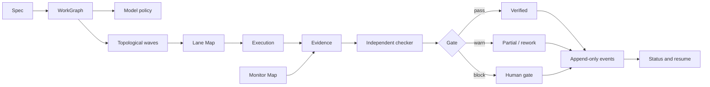

# Arquitetura do House Party Protocol

## Modelo em quatro camadas

| Camada | Responsabilidade | Artefato principal |
|---|---|---|
| Harness | superfície operacional local | `python -m hpp` |
| Protocol | invariantes, eventos, gates e exit codes | `hpp.manifest.json` |
| Módulos | capacidades instaláveis e independentes | dez diretórios versionados |
| Distribuição | entrega por host | marketplace Claude Code e instalador Codex CLI |

O harness é stdlib-first e não executa modelos. Ele coordena arquivos, comandos, políticas e
evidências que continuam sob controle do operador.

## Fluxo principal



## Manifesto executável

`hpp.manifest.json` declara:

- versão do protocol e Python mínimo;
- módulos, paths e versões;
- capacidades fornecidas e requisitos reais;
- cobertura por host;
- bundles;
- papéis e permissões;
- invariantes e transições operacionais;
- monitores e consumers quando declarados.

`hpp doctor` rejeita referências ausentes, ciclos e divergência entre manifesto, marketplace e
plugin manifests.

## Mapas derivados

Os mapas não possuem estado próprio. São projeções de dados existentes:

| Mapa | Fonte | Pergunta respondida |
|---|---|---|
| Capability | manifesto | qual módulo fornece qual capacidade em cada host? |
| Agent | papéis e eventos | quem pode fazer, revisar ou aprovar? |
| Lane | registry, heartbeat e território | quem está trabalhando onde e há colisão? |
| Work | spec e dependências | quais unidades podem entrar na mesma wave? |
| Execution | event log | o que ocorreu e em qual ordem? |
| Evidence | critérios e refs | qual prova sustenta cada veredito? |
| Context/Knowledge | compiler e proveniência | o que entrou no contexto e por quê? |
| Code | manifesto de componentes | qual superfície foi declarada por módulo? |
| Monitor | probes e sinais | o que é observado, quão fresco e quem consome? |

Veja [GRAPH-MODEL.md](GRAPH-MODEL.md).

## WorkGraph e waves

Cada unidade de trabalho possui `id`, `depends_on`, `acceptance` e `tier`. A compilação:

1. valida IDs e referências;
2. rejeita self-edge e ciclos;
3. ordena de forma determinística;
4. agrupa nós independentes na mesma wave;
5. fecha a barreira antes de liberar dependentes.

Paralelismo é consequência do grafo, não um número arbitrário de agentes simultâneos.

## Estado operacional

Eventos são JSONL append-only. A projeção materializada pode ser reconstruída. Eventos inválidos
não substituem o último estado íntegro.

Transições centrais do LoopGraph:

```text
work_started
evidence_recorded
check_passed
human_approved
verified
```

Lane heartbeat, handoff e sinais de saúde mantêm contratos próprios e entram em suas projeções;
não são forçados dentro da máquina de estados de uma execução. `hpp resume` deriva o próximo gate
do event log; ele não pede ao modelo que invente contexto perdido.

## Política

| Modo | Comportamento |
|---|---|
| audit | registra e retorna 0 |
| enforce | retorna 2 para regra classificada como BLOCK |
| manual | interrompe a promoção até decisão humana registrada |

Exit codes do protocol: `0` ok, `1` warn, `2` block, `3` erro.

## Adapters de host

Claude Code oferece plugins e hooks de lifecycle. Codex CLI carrega `AGENTS.md` e skills e executa
o restante por comando explícito. Adapters normalizam o contrato sem alegar paridade inexistente.

| Cobertura | Significado |
|---|---|
| `native` | o host dispara a capacidade no lifecycle declarado |
| `explicit-command` | a capacidade existe via CLI/preflight |
| `unsupported` | não há mecanismo equivalente verificado |

## Dependências

Módulos independentes não ganham dependências artificiais. O grafo diferencia:

- `requires`: requisito duro para funcionar;
- `integrates_with`: composição opcional;
- `provides`: capacidade exportada;
- bundle: conjunto recomendado para um objetivo.

## Limites

Não há daemon, scheduler, fila, servidor, execução direta de modelos, telemetria remota ou banco
de grafo. Monitores não iniciam processos ocultos. Uma futura camada só entra quando houver um
consumidor e um benchmark que justifiquem seu custo operacional.
